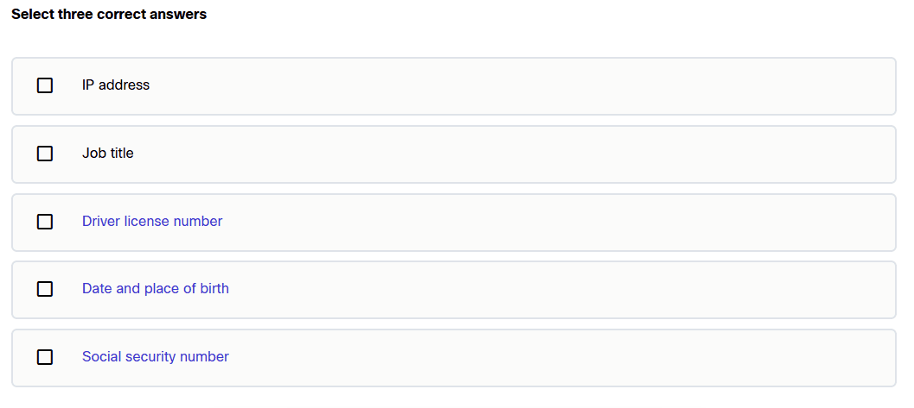
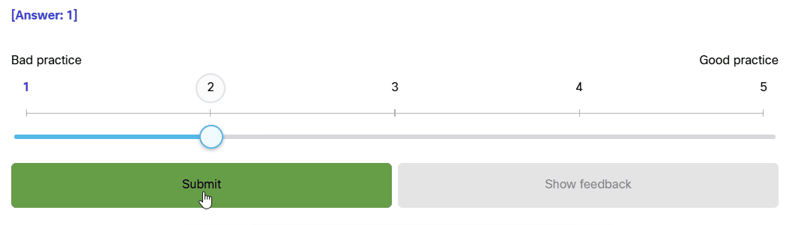
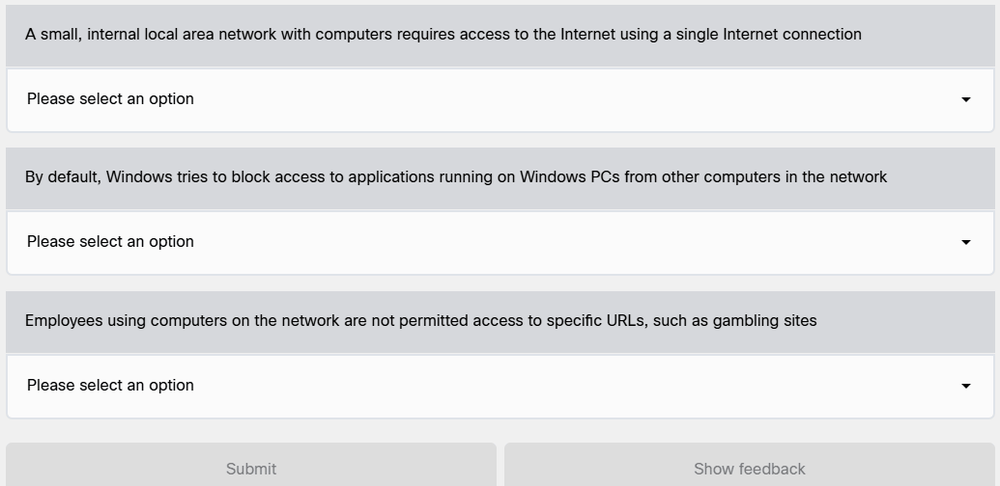
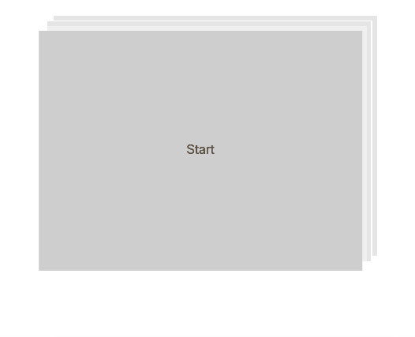
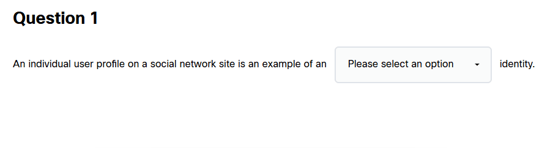
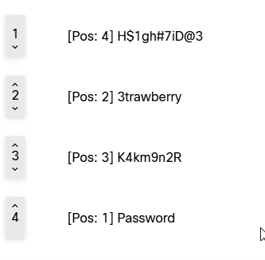

  # Cisco NetAcad Cheat

  

**Cisco NetAcad Answer Helper** is a high-performance userscript developed in Vanilla JavaScript, designed to optimize your study sessions on the Cisco NetAcad platform. It focuses on intelligent answer retrieval, dynamically extracting the correct data from client-side requests and displaying it directly within the exam interface.

---

## Key Features

* Reactive Answer Solver:** Real-time extraction and matching of correct answers for NetAcad exams and activities.
* Advanced Minimalist UI:** Low-distraction floating control panel featuring native Dark Mode support and direct manipulation across Shadow DOM boundaries to ensure answers are always visible.
* Draggable Interface [BETA]: The control panel can be freely moved and repositioned anywhere on the screen by dragging it to suit your workflow.

---

## Compatibility & Question Formats

The script supports and processes the following platform data structures:

### 🟢 Fully Supported Formats
* ✅ **MCQ (Multiple Choice Questions):** Instantly identifies and visually highlights the correct option within the interface.
* ✅ **Sliders & Numerical Scales:** Dynamically locates and marks the exact value of interactive scale components (1-to-N).
* ✅ **Dropdowns (Selection Menus):** Scans nested selection menus and flags the correct option for each field.
* ✅ **Matching:** Identifies and matches independent concepts or vocabulary terms across distinct evaluation fields.
* ✅ **Yes / No (Sequential Analysis):** Evaluates sequential scenario images (e.g., identifying safe vs. unsafe emails) and flags the correct evaluation for each step.

### 🟡 Beta Formats (In Development)
> ⚠️ *Note: Beta formats accurately retrieve answers, but full UI integration (such as toggling, custom styling, or menu customization) is still under refinement and may occasionally encounter minor layout inconsistencies.*

* ⚠️ **Fill in the Blanks [BETA]:** Extracts and displays the exact words required from sentence completion dropdown lists.
* ⚠️ **GMCQ (Graphical Multiple Choice) [BETA]:** Identifies and highlights the correct choice when options consist of images rather than text.
* ⚠️ **Stacker / Ordering [BETA]:** Displays the required sequence for item organization tasks (e.g., ordering security risks from easiest to hardest to exploit).

---

> ⚠️ **Troubleshooting Tip:** Due to dynamic rendering or slow loading times within NetAcad's framework, the script may occasionally fail to inject or highlight answers. If this occurs, simply **refreshing the page (`F5` or `Ctrl + R`)** will re-initialize the script and properly apply the answers.

* ❗ *Special complex formats remain under evaluation for future releases.*

---

## Screenshots & Demos

| MCQ Answers | Slider Answers | Matching Answers |
| :---: | :---: | :---: |
|  |  |  |

| Yes / No Answers | Fill in the Blanks Answers | GMCQ  Answers |
| :---: | :---: | :---: |
|  |  |  |

| Stacker Answers | MENU |
| :---: | :---: |
|  |  |

---

## Installation & Deployment

1. Install the [Tampermonkey](https://www.tampermonkey.net/) extension for your preferred web browser.
2. Visit the distribution repository on Greasy Fork to source the latest stable build:
   * **[Install Cisco NetAcad Cheat](https://greasyfork.org/es/scripts/587797-cisconetacad-cheat-show-answers)**
3. Log in to your Cisco NetAcad account and launch any evaluation. The script will automatically parse the DOM tree and initialize the automation panel.

---

## Technical Architecture

* **JavaScript (ES6+)**: Core logic for DOM manipulation, reactive `MutationObservers`, and event-driven injection trampolines (`onerror`) engineered to access complex Shadow DOM components.
* **Self-Contained CSS3**: Dynamic injection of styles that ensure the UI remains consistent across different exam layouts.
* **GPLv3 License**: Open-source protection and software transparency.

---

## Automatic Updates

This repository is synced directly with **Greasy Fork**. Your browser extension will automatically check for and apply updates to ensure compatibility with the latest NetAcad interface changes.

---

## Disclaimer

This software has been developed exclusively for **educational and research purposes**. The use of this tool within evaluation environments is entirely at the discretion and sole responsibility of the end user. The developer assumes no liability for the misuse of these automation mechanics.

---

   
  Developed by <a href="https://github.com/ByOscarPINE">ByOscarPINE</a>

